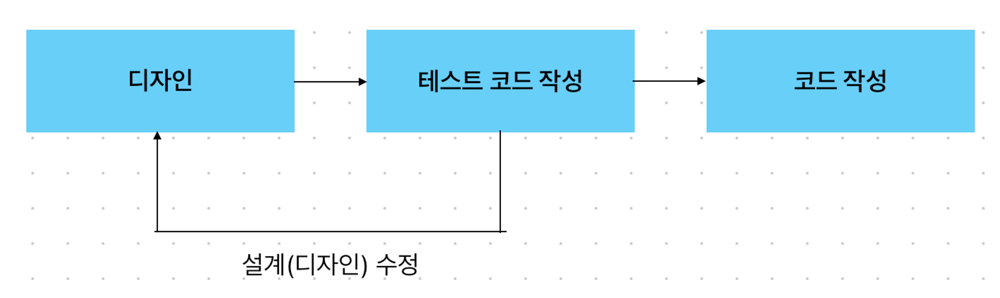
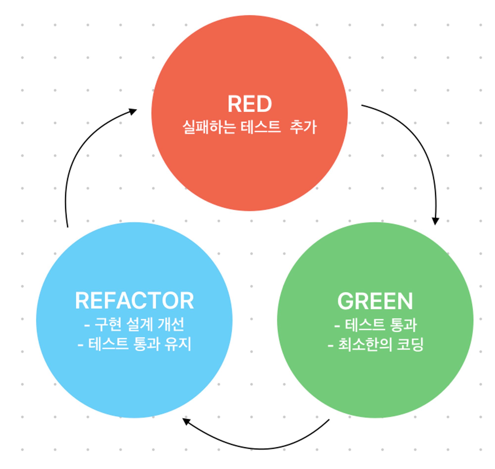

# 00. TDD가 무엇이며 왜 해야하는가?

## 1. TDD가 뭔가요?

- TDD란?
    - TDD란 Test Driven Development의 약자로 “테스트 주도 개발”이라고도 합니다
    - TDD는 개발 방법론 중 하나로 테스트가 전체 개발을 주도해 내가는 것을 말합니다
    - 즉, 비지니스 코드를 먼저 작성하는 것이 아닌 테스트가 중심이 되어 전체 개발 방향을 이끌고 나가는 것입니다
- 개발 프로세스의 차이점
    - 기존의 개발 프로세스

  

    - TDD 개발 프로세스

  

- TDD의 개발 주기

- RED 단계 - 실패하는 테스트 코드를 먼저 작성
    - 구체적인 하나의 요구사항을 검증하는 하나의 테스트를 추가
    - 추가된 테스트가 실패하는지 확인
    - 실패하는 것이 확인 되어야, 테스트가 검증력을 가진다고 신뢰할 수 있음

  > 실패의 이유는 운영 코드가 아직 변경되지 않았기 때문이어야 하며, 테스트 코드의 문제이면 안된다

- GREEND 단계 - 테스트 코드를 성공시키기 위한 실제 코드를 작성
    - 추가된 테스트를 포함하여, 모든 테스트가 성공하게끔 운영 코드를 변경
    - 테스트의 성공은 모든 요구사항을 만족했음을 의미
    - 테스트 성공을 위한 최소한의 코드 변경만 진행

  > 최소한의 코드 그 이상을 변경하거나 추가하면 안됨 테스트 되지 않은 코드가 중간에 추가되면, 이후 리팩토링등의 다른 프로세스에서 어떤 부작용을 가져올지 알 수 없기 때문이다

- REFACTOR 단계 - 중복 코드 제거, 일반화 등의 리펙토링을 수행
    - 코드 베이스를 정리
    - 인터페이스 뒤에 숨어 있는 구현 설계를 개선
    - 가독성, 적용성, 성능을 고려

> **중요한 것은 실패하는 테스트 코드를 작성할 때까지 실제 코드를 작성하지 않는 것과, 실패하는 테스트를 통과할 정도의 최소 실제 코드를 작성해야 하는 것이다. 이를 통해, 실제 코드에 대해 기대되는 바를 보다 명확하게 정의함으로써 불필요한 설계를 피할 수 있고, 정확한 요구 사항에 집중할 수 있다.**

## 2. TDD를 하면서 얻을 수 있는것들은 뭐가 있을까요?

**효과**

- 예측 가능한 개발 방법입니다
    - 끊임없이 발생할 버그에 대해 걱정하지 않고, 일이 언제 마무리될지 알 수 있습니다
- 코드가 가르쳐주는 모든 교훈을 학습할 기회를 갖게 됩니다
    - 처음 생각나는 대로 후딱 완료해 버리면 두 번째 것, 곧 더 나은 것에 대해 생각할 기회를 잃게 됩니다
- TDD를 하면 자신만의 개발 안정성이 올라갑니다
    - 더욱 신뢰도 있는 프로그램으로 즐겁게 코딩할 수 있습니다
- 피드백이 향상됩니다
    - 테스트를 통해 프로세스가 잘 수행되는지를 자주 확인하고 느낄 수 있습니다
- 공유, 협력이 더욱 쉬워집니다
    - 기존 로직을 고치는 것은 두렵습니다 하지만 테스트 코드가 존재하면 ‘왜 이렇게 코드를 작성했지?’, ‘내가 이 코드를 고쳐서 생기는 문제들이 무엇이지?’라는 걱정없이 고칠 수 있는 용기가 생깁니다
    - 테스트 코드를 통해 개발자의 개발 과정(어떤 고민/어떤 의사결정)을 확인하고 왜 그렇게 짰는지 쉽고 빠르게 이해할 수 있습니다.

## 3. TDD 장단점은 무엇일까요?

**장점**

1. 디버깅 시간을 단축할 수 있습니다
    - 통합 테스팅이 아닌 **유닛 테스팅**을 하는 이점이기도합니다
    - 특정 버그를 찾기 위해서 **모든 레벨(레이어)의 코드들**을 살펴봐야합니다
    - 하지만 모든 레이어들을 전부 다 디버깅할 필요 없이 **자동화 된 유닛 테스틍 결과**로 손 쉽게 찾아낼 수 있습니다
2. 작성한 코드가 가지는 불안정성을 개선하여 생산성을 높일 수 있습니다
    - 코드가 내 손을 떠나 사용자에게 도달하기 전에 **문제가 없는지 먼저 진단 받을 수 있**습니다
3. 재설계 시간을 단축할 수 있습니다
    - 테스트 코드를 먼저 작성하기 때문에 개발자가 **지금 무엇을 해야하는지 분명히 정의**하고 개발을 시작하게 됩니다
    - 또한 테스트 시나리오를 작성하면서 다양한 예외사항에 대해 생각해 볼 수 있습니다

**단점**

1. 가장 큰 단점은 바로 생산성의 저하입니다
    - TDD 방식의 개발 시간은 일반적인 개발 방식에 비해 대락 10~30% 정도로 늘어납니다
    - SI 프로젝트에서는 소프트웨어의 품질보다 납기일 준수가 훨씬 중요하기 때문에 TDD 방식을 잘 사용하지 않습니다
2. 자신이 개발하던 방식을 많이 바꿔야 합니다
    - 이미 시간이 지나 습관이 들어버린 것에 대해 고치기 어렵습니다
    - 오히려 개발을 많이 하지 않은 사람들에게 적용하기 쉽습니다
3. 구조에 얽매입니다
    - 테스트는 말 그대로 테스트일 뿐 실제 코드가 더 중요한 상황인데도 불구하고 테스트 원칙 때문에 쉽게 넘어가지 못하는 경우입니다
