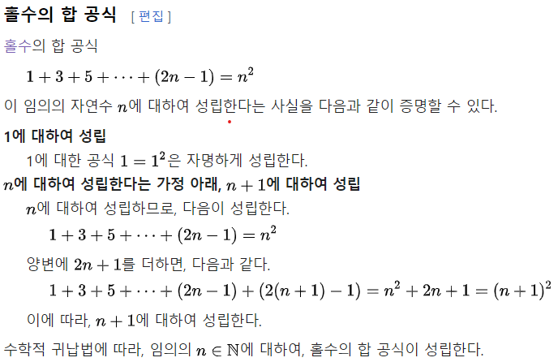

## 28장. 초록막대 패턴 ##

### 가짜로 구현하기(진짜로 만들기 전까지만) ###

실패하는 테스트를 만든 후 첫번째 구현은 어떻게 하는게 좋을까?

- > 상수를 반환하게 하라. 일단 테스트가 통과하면 단계적으로 상수에서 변수로 바꾼다.

왜 하느냐?

- > 뭔가 돌아가는 걸 가진 게 그렇지 않은 것보다 좋고,
  몰랐던 오류의 재발견 효과

가짜로 구현하기의 강력한 두가지 효과

- 심리학적 효과 - 초록막대일때 자신의 위치를 알수 있고, 확신을 가지고 리팩토링 할수 있음.
    - 내가 손봐야 할 곳 명확하게 인지
- 범위 scope 조절 - 구체적인 예에서 일반화하면 혼동되는 상황을 예방함. 물론 이전 테스트 작동이 보장되면 다음 테스트에 더 집중하게 됨.
    - 사고의 비약 방지

### 삼각측량 ###

추상화 과정을 테스트로 주도할 때 어떻게 보수적으로 할 수 있을까?

- > 오로지 예가 두개 이상일 때에만 추상화 하라.

규칙이 명확한 삼각측량

- 수학적 귀납법?

    - > 
    - 출처 : [수학적 귀납법 - 위키백과, 우리 모두의 백과사전](https://ko.wikipedia.org/wiki/수학적_귀납법)

### 명백한 구현 ###

단순한 연산들을 어떻게 구현하는가?

- > 그냥 구현해라.

확신이 든다면 명백한 구현.

실패한다면(빨간막대를 본다면) -> 가짜 구현 or 삼각측량

제대로 구현하면서 깨끗한 코드를 만드는건 비현실적일수 있으므로 확실한 것 부터 차근차근 진행

빨강 / 초록 / 리팩토링의 리듬을 유지

- 계속 수련하며 명백한 구현과 가짜/삼각측량의 리듬 잡기

### 하나에서 여럿으로 ###

객체 컬렉션을 다루는 연산은 어떻게 구현하나?

- >일단 컬렉션 없이 구현하고 그 다음에 컬렉션을 사용

점진적으로 대입하기.

*변화 격리하기*

ex)

1. 인자 단일값 하나 받아 구현
2. 인자에 컬렉션 추가, 테스트 케이스에도 컬렉션 인자 추가
3. 이후에 사용하지 않는 단일값 삭제후 대신 컬렉션 사용.

코드를 고쳐 테스트 케이스를 바꿔도 코드에 영향이 없도록 하며 테스트 케이스를 개선할수 있다.