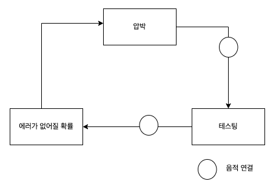

### 영향도

---

목적

- 한 시스템의 요소들이 서로 어떻게 영향을 끼치는지 보는것

세가지 요소

- 활동
- 양적 연결 - 시점 활동의 증가가 종점 활동의 증가를 야기하고, 시점 활동의 감소가 종점 활동의 감소를 야기하는 경향이 있음
- 음적 연결 - 시점 활동의 증가가 종점 활동의 감소를 야기, 시점 활동의 감소가 종점 활동의 증가를 야기하는 경향이 있음

⇒ 이러한 연결은 한방향이 아니라 서로 영향을 준다.

1. 시간의 압박을 받게 되면
2. 테스트의 양은 줄어든다.
3. 에러가 없어질 확률은 줄어든다.
4. 압박은 늘어난다.